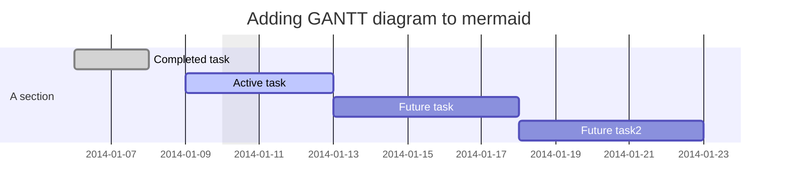
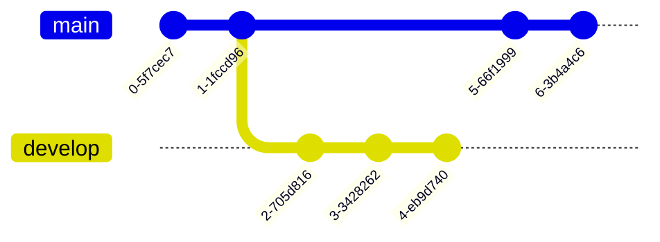
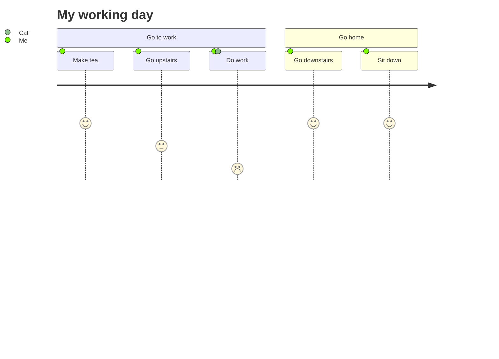

graph TD
    A[Friend's Birthday] -->|Get money| B(Go shopping)
    B --> C{Let me think}
    C -->|One| D["Cool <br> Laptop"]
    C -->|Two| E[iPhone]
    C -->|Three| F[fa:fa-car Car]
    
Flowchart
```mermaid
graph TD;
    A—>B;
    A—>C;
    B—>D;
    C—>D;
```

Sequence Diagram
```mermaid
sequenceDiagram
    participant Alice
    participant Bob
    Alice->>John: Hello John, how are you?
    loop Healthcheck
        John->>John: Fight against hypochondria
    end
    Note right of John: Rational thoughts <br/>prevail!
    John—>>Alice: Great!
    John->>Bob: How about you?
    Bob—>>John: Jolly good!
```

Gantt Diagram


Class Diagram
```mermaid
classDiagram
Class01 <|— AveryLongClass : Cool
Class03 *— Class04
Class05 o— Class06
Class07 .. Class08
Class09 —> C2 : Where am i?
Class09 —* C3
Class09 —|> Class07
Class07 : equals()
Class07 : Object[] elementData
Class01 : size()
Class01 : int chimp
Class01 : int gorilla
Class08 <—> C2: Cool label
```

Git Graph


Entity Relationship Diagram
```mermaid
erDiagram
    CUSTOMER ||—o{ ORDER : places
    ORDER ||—|{ LINE-ITEM : contains
    CUSTOMER }|..|{ DELIVERY-ADDRESS : uses
```

User Journey Diagram


```geojson
{
  “type”: “FeatureCollection”,
  “features”: [
    {
      “type”: “Feature”,
      “id”: 1,
      “properties”: {
        “ID”: 0
      },
      “geometry”: {
        “type”: “Polygon”,
        “coordinates”: [
          [
              [-90,35],
              [-90,30],
              [-85,30],
              [-85,35],
              [-90,35]
          ]
        ]
      }
    }
  ]
}
```

```topojson
{
  “type”: “Topology”,
  “transform”: {
    “scale”: [0.0005000500050005, 0.00010001000100010001],
    “translate”: [100, 0]
  },
  “objects”: {
    “example”: {
      “type”: “GeometryCollection”,
      “geometries”: [
        {
          “type”: “Point”,
          “properties”: {“prop0”: “value0”},
          “coordinates”: [4000, 5000]
        },
        {
          “type”: “LineString”,
          “properties”: {“prop0”: “value0”, “prop1”: 0},
          “arcs”: [0]
        },
        {
          “type”: “Polygon”,
          “properties”: {“prop0”: “value0”,
            “prop1”: {“this”: “that”}
          },
          “arcs”: [[1]]
        }
      ]
    }
  },
  “arcs”: [[[4000, 0], [1999, 9999], [2000, -9999], [2000, 9999]],[[0, 0], [0, 9999], [2000, 0], [0, -9999], [-2000, 0]]]
}
```

```stl
solid cube_corner
  facet normal 0.0 -1.0 0.0
    outer loop
      vertex 0.0 0.0 0.0
      vertex 1.0 0.0 0.0
      vertex 0.0 0.0 1.0
    endloop
  endfacet
  facet normal 0.0 0.0 -1.0
    outer loop
      vertex 0.0 0.0 0.0
      vertex 0.0 1.0 0.0
      vertex 1.0 0.0 0.0
    endloop
  endfacet
  facet normal -1.0 0.0 0.0
    outer loop
      vertex 0.0 0.0 0.0
      vertex 0.0 0.0 1.0
      vertex 0.0 1.0 0.0
    endloop
  endfacet
  facet normal 0.577 0.577 0.577
    outer loop
      vertex 1.0 0.0 0.0
      vertex 0.0 1.0 0.0
      vertex 0.0 0.0 1.0
    endloop
  endfacet
endsolid
```

Embedding
    <script src=“https://embed.github.com/view/geojson/<username>/<repo>/<ref>/<path_to_file>”></script>

CSV

mmd file is mermaid